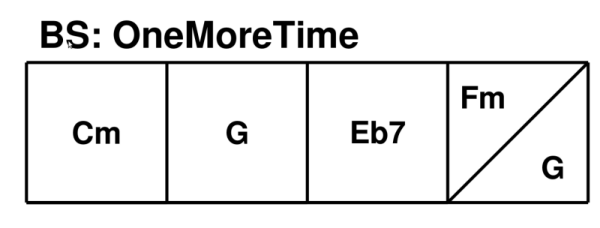

# chordbars
A music-related LaTeX package useful to write chord grids.

From a given chord progression (a harmonic pattern), it draws nice rectangles (one square per bar) with the chord name inside, and shows the number of repetitions and the bar count.
For details, see included manual.

* Author: S. Kramm - 2018-2024
* Home page: https://github.com/skramm/chordbars
* Manual: [chordbars_manual.pdf](chordbars_manual.pdf)
* Licence: The LaTeX project public license (LPPL), version 1.3c

latest release: v1.3.2, 02/03/2024

Available via CTAN: https://ctan.org/pkg/chordbars

